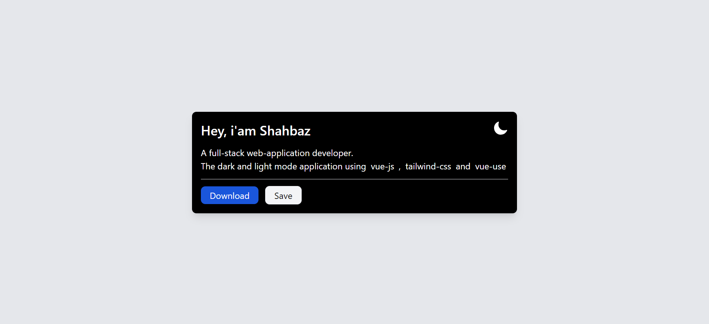

<div align="center">
      
      
  </div>

<h1 align="center">
    Setup Dark and Light Mode in VueJS using Tailwind-CSS
</h1>

## Project Setup

Create or install the `vue-js` application and `tailwind-css` framework.

## Install VueUse library

```sh
npm i vueuse/core
```

## Change in tailwind.config.js

Add the darkMode:"class" object

```js
export default {
  darkMode: "class",
  content: ["./index.html", "./src/**/*.{vue,js,ts,jsx,tsx}"],
  theme: {
    extend: {},
  },
  plugins: [],
};
```

## Vue Template

```html
<template>
  <p>isDark: {{ isDark }}</p>
  <button @click="toggleBtn()" class="px-4 py-2 text-white bg-blue-700 rounded dark:bg-purple-500">
    Toggle Dark Mode
  </button>
</template>
```

## Script Setup

```js
<script setup>
  import {(useDark, useToggle)} from '@vueuse/core'; const isDark = useDark(); const toggleBtn =
  useToggle(isDark);
</script>
```

<div align="center">
&copy; Shahbaz Ahmad | A fullstack web application developer
</div>
